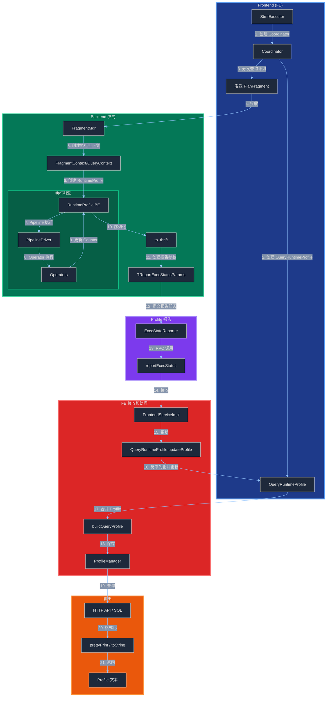
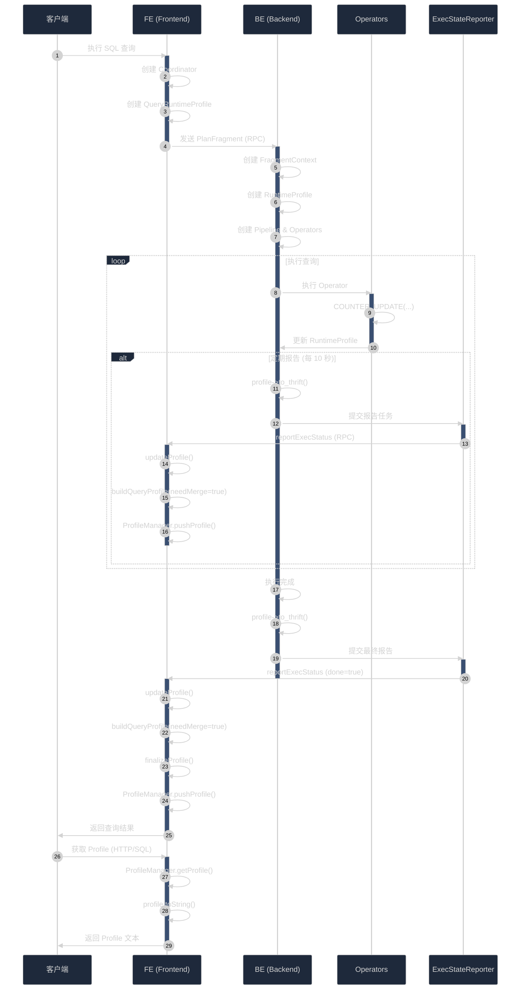
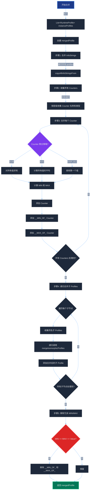

# StarRocks Query Profile 生成机制详解

## 文档概述

本文档深入分析 StarRocks 查询 Profile 的生成机制，包括数据结构、生成流程、序列化机制和传输过程。通过阅读此文档，您将了解：
- Profile 的核心数据结构（BE 和 FE）
- Profile 从 BE 生成到 FE 收集的完整流程
- Profile 数据格式和序列化机制
- Profile 在系统中的流转过程

## 1. Profile 数据结构

### 1.1 Thrift 定义（IDL）

StarRocks 使用 Thrift 作为 BE 和 FE 之间的通信协议。Profile 的数据结构定义在 `gensrc/thrift/RuntimeProfile.thrift`：

```thrift
// Counter 聚合类型
enum TCounterAggregateType {
    SUM,        // BE 和 FE 阶段都使用求和
    AVG,        // BE 和 FE 阶段都使用平均值
    SUM_AVG,    // BE 阶段求和，FE 阶段平均
    AVG_SUM,    // BE 阶段平均，FE 阶段求和
}

// Counter 合并类型
enum TCounterMergeType {
    MERGE_ALL,           // 合并所有
    SKIP_ALL,           // 跳过所有合并
    SKIP_FIRST_MERGE,   // 跳过第一次合并
    SKIP_SECOND_MERGE,  // 跳过第二次合并
}

// Counter 最小/最大值类型
enum TCounterMinMaxType {
    MIN_MAX_ALL = 0,  // 收集最小最大值
    SKIP_ALL = 1      // 跳过收集
}

// Counter 策略
struct TCounterStrategy {
    1: required TCounterAggregateType aggregate_type
    2: required TCounterMergeType merge_type
    3: required i64 display_threshold = 0     // 显示阈值
    4: optional TCounterMinMaxType min_max_type = TCounterMinMaxType.MIN_MAX_ALL
}

// Counter 数据
struct TCounter {
    1: required string name                    // Counter 名称
    2: required TUnit type                     // 数据类型（TIME_NS, BYTES, UNIT等）
    3: required i64 value                      // Counter 值
    5: optional TCounterStrategy strategy      // 聚合策略
    6: optional i64 min_value                  // 最小值
    7: optional i64 max_value                  // 最大值
}

// 单个 Profile 节点
struct TRuntimeProfileNode {
    1: required string name                                  // 节点名称
    2: required i32 num_children                            // 子节点数量
    3: required list<TCounter> counters                     // Counter 列表
    4: required i64 metadata                                // 元数据（如节点ID）
    5: required bool indent                                 // 是否缩进显示
    6: required map<string, string> info_strings           // 信息字符串映射
    7: required list<string> info_strings_display_order    // 显示顺序
    8: required map<string, set<string>> child_counters_map // 父子Counter映射
    9: optional i64 version                                // Profile 版本
}

// Profile 树（扁平化的树结构）
struct TRuntimeProfileTree {
    1: required list<TRuntimeProfileNode> nodes  // 节点列表（前序遍历）
}
```

### 1.2 BE 端数据结构（C++）

**文件**: `be/src/util/runtime_profile.h` / `runtime_profile.cpp`

```cpp
class RuntimeProfile {
public:
    // Counter 基类
    class Counter {
        std::atomic<int64_t> _value;        // Counter 值
        const TUnit::type _type;            // 数据类型
        const TCounterStrategy _strategy;   // 聚合策略
        std::optional<int64_t> _min_value;  // 最小值
        std::optional<int64_t> _max_value;  // 最大值
    };
    
private:
    std::string _name;                      // Profile 名称
    ObjectPool* _pool;                      // 对象池
    Counter _counter_total_time;            // 总时间计数器
    
    // Counter 映射: Counter名称 -> (Counter指针, 父Counter名称)
    CounterMap _counter_map;
    
    // 子Counter映射: 父Counter名称 -> {子Counter名称集合}
    ChildCounterMap _child_counter_map;
    
    // 信息字符串
    InfoStrings _info_strings;
    std::vector<std::string> _info_strings_display_order;
    
    // 子Profile
    ChildVector _children;  // vector<pair<RuntimeProfile*, bool>>
    ChildMap _child_map;    // map<string, RuntimeProfile*>
    
    int64_t _version;       // Profile 版本（用于增量更新）
};
```

**关键方法**:
- `add_counter()`: 添加 Counter
- `add_info_string()`: 添加信息字符串
- `add_child()`: 添加子 Profile
- `to_thrift()`: 序列化为 Thrift 结构
- `update()`: 从 Thrift 结构更新

### 1.3 FE 端数据结构（Java）

**文件**: `fe/fe-core/src/main/java/com/starrocks/common/util/RuntimeProfile.java`

```java
public class RuntimeProfile {
    private String name;                                           // Profile 名称
    private double localTimePercent;                              // 本地时间百分比
    private volatile long version = 0;                            // Profile 版本
    
    // Counter 映射: Counter名称 -> (Counter, 父Counter名称)
    private final Map<String, Pair<Counter, String>> counterMap;
    
    // 子Counter映射: 父Counter名称 -> {子Counter名称集合}
    private final Map<String, Set<String>> childCounterMap;
    
    // 信息字符串
    private final Map<String, String> infoStrings;
    
    // 子Profile列表: (RuntimeProfile, 是否缩进)
    private final List<Pair<RuntimeProfile, Boolean>> childList;
    
    // 子Profile映射: 名称 -> RuntimeProfile
    private final Map<String, RuntimeProfile> childMap;
    
    // Counter 内部类
    public static class Counter {
        private long value;                 // Counter 值
        private TUnit type;                 // 数据类型
        private TCounterStrategy strategy;  // 聚合策略
        private Optional<Long> minValue;    // 最小值
        private Optional<Long> maxValue;    // 最大值
    }
}
```

**关键方法**:
- `addCounter()`: 添加 Counter
- `addInfoString()`: 添加信息字符串
- `addChild()`: 添加子 Profile
- `toThrift()`: 序列化为 Thrift 结构
- `update()`: 从 Thrift 结构更新
- `mergeIsomorphicProfiles()`: 合并同构的 Profile
- `prettyPrint()` / `toString()`: 格式化输出

### 1.4 ProfileManager（FE）

**文件**: `fe/fe-core/src/main/java/com/starrocks/common/util/ProfileManager.java`

```java
public class ProfileManager {
    // Profile 元素
    public static class ProfileElement {
        Map<String, String> infoStrings;    // 查询基本信息
        byte[] profileContent;              // Gzip 压缩的 Profile 内容
        ProfilingExecPlan plan;             // 执行计划
    }
    
    // Profile 映射: QueryId -> ProfileElement
    private final LinkedHashMap<String, ProfileElement> profileMap;
    
    // Profile 头部字段
    public static final ArrayList<String> PROFILE_HEADERS = new ArrayList<>(
        Arrays.asList(QUERY_ID, USER, DEFAULT_DB, SQL_STATEMENT, 
                      QUERY_TYPE, START_TIME, END_TIME, TOTAL_TIME, 
                      QUERY_STATE, WAREHOUSE_CNGROUP)
    );
}
```

**关键方法**:
- `pushProfile()`: 保存 Profile 到内存
- `getProfile()`: 根据 QueryId 获取 Profile
- `getAllQueries()`: 获取所有查询列表

### 1.5 QueryRuntimeProfile（FE）

**文件**: `fe/fe-core/src/main/java/com/starrocks/qe/scheduler/QueryRuntimeProfile.java`

```java
public class QueryRuntimeProfile {
    private RuntimeProfile queryProfile;              // 查询级别 Profile
    private List<RuntimeProfile> fragmentProfiles;    // Fragment 级别 Profile 列表
    private Optional<RuntimeProfile> loadChannelProfile;  // LoadChannel Profile
    
    // 用于同步等待所有实例完成
    private MarkedCountDownLatch<TUniqueId, Long> profileDoneSignal;
}
```

**关键方法**:
- `buildQueryProfile()`: 构建和合并查询 Profile
- `updateProfile()`: 更新运行时 Profile
- `mergeLoadChannelProfile()`: 合并 LoadChannel Profile
- `finalizeProfile()`: 完成 Profile（排序子节点）

## 2. Profile 生成流程

### 2.1 整体流程图



### 2.2 详细流程说明

#### 阶段 1: FE 初始化（Query 执行前）

**位置**: `fe/fe-core/src/main/java/com/starrocks/qe/StmtExecutor.java`

1. **StmtExecutor.execute()** 开始执行 SQL
2. **创建 Coordinator**: 负责协调查询执行
3. **创建 QueryRuntimeProfile**: 
   ```java
   QueryRuntimeProfile queryRuntimeProfile = new QueryRuntimeProfile(
       connectContext, jobSpec, isShortCircuit
   );
   ```
4. **初始化 Fragment Profiles**:
   ```java
   queryRuntimeProfile.initFragmentProfiles(numFragments);
   ```
5. **分发查询计划**: 通过 RPC 发送 `TPlanFragmentExecRequest` 到 BE

#### 阶段 2: BE 创建 Profile（Query 执行开始）

**位置**: `be/src/runtime/fragment_mgr.cpp`, `be/src/exec/pipeline/fragment_context.cpp`

1. **FragmentMgr.exec_plan_fragment()** 接收查询计划
2. **创建 FragmentContext / QueryContext**:
   ```cpp
   auto fragment_ctx = std::make_shared<FragmentContext>();
   ```
3. **创建 RuntimeProfile**:
   ```cpp
   RuntimeProfile* profile = fragment_ctx->runtime_state()->runtime_profile();
   ```
4. **创建 Pipeline 和 Operator**:
   - 每个 Pipeline 创建一个子 Profile
   - 每个 Operator 创建一个子 Profile
   ```cpp
   RuntimeProfile* pipeline_profile = profile->create_child("Pipeline (id=0)");
   RuntimeProfile* operator_profile = pipeline_profile->create_child("SCAN (plan_node_id=0)");
   ```

#### 阶段 3: BE 执行并更新 Profile（Query 执行中）

**位置**: `be/src/exec/pipeline/pipeline_driver_executor.cpp`, Operator 实现文件

1. **PipelineDriver 执行**:
   ```cpp
   void PipelineDriver::process() {
       SCOPED_TIMER(_driver_timer);  // 自动更新 DriverTotalTime
       // ... 执行逻辑
   }
   ```

2. **Operator 更新 Counter**:
   ```cpp
   // 在 Operator 中更新各种指标
   COUNTER_UPDATE(_rows_returned_counter, chunk->num_rows());
   COUNTER_UPDATE(_bytes_read_counter, bytes);
   SCOPED_TIMER(_scan_timer);  // 自动计时
   ```

3. **常见的 Counter 类型**:
   - `OperatorTotalTime`: Operator 总执行时间
   - `PullChunkNum` / `PushChunkNum`: Pull/Push 的 Chunk 数量
   - `PullRowNum` / `PushRowNum`: Pull/Push 的行数
   - `ScanTime`: 扫描时间
   - `NetworkTime`: 网络传输时间
   - `BytesRead` / `BytesReceived`: 读取/接收的字节数

#### 阶段 4: BE 序列化 Profile

**位置**: `be/src/util/runtime_profile.cpp`

```cpp
void RuntimeProfile::to_thrift(TRuntimeProfileTree* tree) {
    tree->nodes.clear();
    to_thrift(&tree->nodes);
}

void RuntimeProfile::to_thrift(std::vector<TRuntimeProfileNode>* nodes) {
    // 1. 创建当前节点
    TRuntimeProfileNode node;
    node.name = _name;
    node.metadata = _metadata;
    node.__set_version(_version);
    
    // 2. 序列化 Counters
    for (auto& [name, pair] : _counter_map) {
        if (pair.first->should_display()) {
            TCounter counter;
            counter.__set_name(name);
            counter.__set_value(pair.first->value());
            counter.__set_type(pair.first->type());
            counter.__set_strategy(pair.first->strategy());
            if (pair.first->_min_value.has_value()) {
                counter.__set_min_value(pair.first->_min_value.value());
            }
            if (pair.first->_max_value.has_value()) {
                counter.__set_max_value(pair.first->_max_value.value());
            }
            node.counters.push_back(counter);
        }
    }
    
    // 3. 序列化 Info Strings
    node.info_strings = _info_strings;
    node.info_strings_display_order = _info_strings_display_order;
    
    // 4. 序列化子 Counter 映射
    node.child_counters_map = _child_counter_map;
    
    // 5. 添加到节点列表
    nodes->push_back(node);
    
    // 6. 递归序列化子节点（前序遍历）
    for (auto& [child, indent] : _children) {
        child->to_thrift(nodes);
    }
}
```

#### 阶段 5: BE 报告 Profile 到 FE

**位置**: `be/src/exec/pipeline/exec_state_reporter.cpp`

1. **创建报告参数**:
   ```cpp
   auto params = ExecStateReporter::create_report_exec_status_params(
       query_ctx, fragment_ctx, profile, load_channel_profile, status, done
   );
   
   // 序列化 Profile
   if (query_ctx->enable_profile()) {
       profile->to_thrift(&params->profile);
       params->__isset.profile = true;
   }
   ```

2. **提交报告任务**:
   ```cpp
   _exec_state_reporter->submit([params, exec_env, fe_addr]() {
       ExecStateReporter::report_exec_status(*params, exec_env, fe_addr);
   });
   ```

3. **RPC 调用**:
   ```cpp
   Status ExecStateReporter::report_exec_status(
       const TReportExecStatusParams& params, ExecEnv* exec_env, 
       const TNetworkAddress& fe_addr) {
       TReportExecStatusResult res;
       rpc_status = ThriftRpcHelper::rpc<FrontendServiceClient>(
           fe_addr, 
           [&](FrontendServiceConnection& client) { 
               client->reportExecStatus(res, params); 
           },
           config::thrift_rpc_timeout_ms, 1
       );
       return rpc_status;
   }
   ```

4. **报告频率**:
   - **运行时报告**: 每隔 `runtime_profile_report_interval` 秒报告一次（默认 10 秒）
   - **完成报告**: 查询完成时立即报告
   - **失败报告**: 查询失败时立即报告

#### 阶段 6: FE 接收和更新 Profile

**位置**: `fe/fe-core/src/main/java/com/starrocks/service/FrontendServiceImpl.java`

```java
public TReportExecStatusResult reportExecStatus(TReportExecStatusParams params) {
    // 1. 查找对应的 Coordinator
    Coordinator coord = QeProcessorImpl.INSTANCE.getCoordinator(params.query_id);
    
    // 2. 更新执行状态
    coord.updateFragmentExecStatus(params);
}
```

**位置**: `fe/fe-core/src/main/java/com/starrocks/qe/scheduler/QueryRuntimeProfile.java`

```java
public void updateProfile(FragmentInstanceExecState execState, 
                         TReportExecStatusParams params) {
    if (params.isSetProfile()) {
        profileAlreadyReported = true;
    }
    
    // 反序列化并更新 Profile
    RuntimeProfile instanceProfile = execState.getProfile();
    if (instanceProfile == null) {
        instanceProfile = new RuntimeProfile("Instance");
        execState.setProfile(instanceProfile);
    }
    instanceProfile.update(params.profile);
    
    // 定期保存运行时 Profile
    if (shouldSaveRuntimeProfile()) {
        RuntimeProfile topProfile = buildQueryProfile(true);
        ProfileManager.getInstance().pushProfile(profilingPlan, topProfile);
    }
}
```

#### 阶段 7: FE 合并 Profile

**位置**: `fe/fe-core/src/main/java/com/starrocks/qe/scheduler/QueryRuntimeProfile.java`

```java
public RuntimeProfile buildQueryProfile(boolean needMerge) {
    if (!needMerge) {
        return queryProfile;
    }
    
    RuntimeProfile newQueryProfile = new RuntimeProfile("Execution");
    
    // 1. 复制查询级别的 Counter 和 Info Strings
    newQueryProfile.copyAllInfoStringsFrom(queryProfile, null);
    newQueryProfile.copyAllCountersFrom(queryProfile);
    
    // 2. 遍历每个 Fragment
    for (RuntimeProfile fragmentProfile : fragmentProfiles) {
        RuntimeProfile newFragmentProfile = new RuntimeProfile(fragmentProfile.getName());
        
        // 获取该 Fragment 的所有 Instance Profiles
        List<RuntimeProfile> instanceProfiles = fragmentProfile.getChildList()
            .stream().map(pair -> pair.first).collect(Collectors.toList());
        
        // 3. 合并同构的 Instance Profiles
        RuntimeProfile mergedInstanceProfile = 
            RuntimeProfile.mergeIsomorphicProfiles(
                instanceProfiles, 
                Sets.newHashSet("Address", "InstanceId")
            );
        
        // 4. 复制合并后的 Profile 到 Fragment Profile
        newFragmentProfile.copyAllInfoStringsFrom(mergedInstanceProfile, null);
        newFragmentProfile.copyAllCountersFrom(mergedInstanceProfile);
        mergedInstanceProfile.getChildList().forEach(pair -> {
            newFragmentProfile.addChild(pair.first);
        });
        
        // 5. 添加到查询 Profile
        newQueryProfile.addChild(newFragmentProfile);
    }
    
    // 6. 计算聚合指标
    // - QueryCumulativeCpuTime: 所有实例的 CPU 时间总和
    // - QueryPeakMemoryUsage: 所有实例的峰值内存最大值
    // - QueryCumulativeScanTime: 所有扫描时间总和
    // - QueryCumulativeNetworkTime: 所有网络时间总和
    
    // 7. 移除冗余的 MIN/MAX 指标
    RuntimeProfile.removeRedundantMinMaxMetrics(newFragmentProfile);
    
    return newQueryProfile;
}
```

**合并算法** (`RuntimeProfile.mergeIsomorphicProfiles()`):

```java
public static RuntimeProfile mergeIsomorphicProfiles(
    List<RuntimeProfile> profiles, Set<String> excludedInfoStrings) {
    
    RuntimeProfile mergedProfile = new RuntimeProfile(profiles.get(0).getName());
    
    // 1. 合并 Info Strings（去重）
    for (RuntimeProfile profile : profiles) {
        mergedProfile.copyAllInfoStringsFrom(profile, excludedInfoStrings);
    }
    
    // 2. 收集所有 Counters（按层级遍历）
    Map<String, Pair<TUnit, String>> allCounters = collectAllCounters(profiles);
    
    // 3. 合并每个 Counter
    for (String counterName : allCounters.keySet()) {
        List<Counter> counters = profiles.stream()
            .map(p -> p.getCounter(counterName))
            .filter(Objects::nonNull)
            .collect(Collectors.toList());
        
        // 根据策略合并
        Counter mergedCounter = mergeCounters(counters);
        
        // 计算 MIN/MAX
        long minValue = counters.stream().mapToLong(Counter::getValue).min().orElse(0);
        long maxValue = counters.stream().mapToLong(Counter::getValue).max().orElse(0);
        
        mergedProfile.addCounter(counterName, mergedCounter);
        mergedProfile.addCounter("__MIN_OF_" + counterName, minValue);
        mergedProfile.addCounter("__MAX_OF_" + counterName, maxValue);
    }
    
    // 4. 递归合并子 Profiles
    for (int i = 0; i < maxChildSize; i++) {
        List<RuntimeProfile> childProfiles = profiles.stream()
            .map(p -> p.getChild(childName))
            .filter(Objects::nonNull)
            .collect(Collectors.toList());
        
        RuntimeProfile mergedChild = mergeIsomorphicProfiles(childProfiles, excludedInfoStrings);
        mergedProfile.addChild(mergedChild);
    }
    
    return mergedProfile;
}
```

#### 阶段 8: FE 保存 Profile

**位置**: `fe/fe-core/src/main/java/com/starrocks/common/util/ProfileManager.java`

```java
public String pushProfile(ProfilingExecPlan plan, RuntimeProfile profile) {
    // 1. 生成 Profile 字符串
    String profileString = generateProfileString(profile);
    
    // 2. 创建 ProfileElement
    ProfileElement element = createElement(
        profile.getChildList().get(0).first, profileString
    );
    element.plan = plan;
    
    // 3. Gzip 压缩
    try {
        element.profileContent = CompressionUtils.gzipCompressString(profileString);
    } catch (IOException e) {
        LOG.warn("Compress profile string failed");
    }
    
    // 4. 保存到内存（LRU）
    String queryId = element.infoStrings.get(QUERY_ID);
    writeLock.lock();
    try {
        profileMap.put(queryId, element);
        
        // 如果超过限制，移除最老的
        if (profileMap.size() > Config.profile_info_reserved_num) {
            String removedQueryId = profileMap.keySet().iterator().next();
            profileMap.remove(removedQueryId);
        }
    } finally {
        writeLock.unlock();
    }
    
    return profileString;
}

private String generateProfileString(RuntimeProfile profile) {
    switch (Config.profile_info_format) {
        case "default":
            return profile.toString();  // 文本格式
        case "json":
            RuntimeProfile.ProfileFormatter formatter = 
                new RuntimeProfile.JsonProfileFormatter();
            return formatter.format(profile, "");
        default:
            return profile.toString();
    }
}
```

#### 阶段 9: 查询和格式化 Profile

**方式 1: HTTP API**

```bash
# 获取 Profile
curl "http://fe_host:fe_http_port/api/v2/profile?query_id=<query_id>"
```

**实现**: `fe/fe-core/src/main/java/com/starrocks/http/rest/v2/ProfileActionV2.java`

```java
protected void executeWithoutPassword(BaseRequest request, BaseResponse response) {
    String queryId = request.getSingleParameter("query_id");
    String queryProfileStr = ProfileManager.getInstance().getProfile(queryId);
    
    if (queryProfileStr != null) {
        sendSuccessResponse(response, queryProfileStr, request);
    } else {
        sendErrorResponse(response, "Profile not found");
    }
}
```

**方式 2: SQL 查询**

```sql
-- 查看所有查询
SELECT * FROM information_schema.queries;

-- 获取指定查询的 Profile
EXPLAIN ANALYZE <SQL>;
```

**格式化输出** (`RuntimeProfile.toString()`):

```java
public String toString() {
    StringBuilder builder = new StringBuilder();
    prettyPrint(builder, "");
    return builder.toString();
}

private void prettyPrint(StringBuilder builder, String prefix) {
    // 1. Profile 名称和总时间
    builder.append(prefix).append(name).append(":\n");
    
    // 2. Info Strings
    for (Map.Entry<String, String> entry : infoStrings.entrySet()) {
        builder.append(prefix).append("   - ").append(entry.getKey())
               .append(": ").append(entry.getValue()).append("\n");
    }
    
    // 3. Counters（递归打印子 Counters）
    printChildCounters(builder, prefix, ROOT_COUNTER);
    
    // 4. 子 Profiles（递归）
    for (Pair<RuntimeProfile, Boolean> child : childList) {
        String childPrefix = child.second ? prefix + "  " : prefix;
        child.first.prettyPrint(builder, childPrefix);
    }
}
```

## 3. Profile 数据格式

### 3.1 文本格式示例

```
Query:
  Summary:
     - Query ID: b1f9a935-a967-11f0-b3d8-f69e292b7593
     - Start Time: 2025-10-15 09:38:48
     - End Time: 2025-10-15 11:09:43
     - Total: 1h30m
     - Query Type: Query
     - Query State: Finished
     - StarRocks Version: 3.5.2-69de616
     - User: explore_service
     - Default Db: 
     - Sql Statement: select t.* from dw_informerplus_charge.dwd_charge_detail_inc_d_all t limit 1
  Planner:
     - -- Parser[1] 0
     - -- Total[1] 13ms
     -     -- Analyzer[1] 1ms
     -         -- Lock[1] 0
  Execution:
     - QueryCumulativeCpuTime: 2.655ms
     - QueryPeakMemoryUsagePerNode: 12.768 GB
    Fragment 0:
       - BackendAddresses: analysis-cloud-prod-be-6:9060
       - InstanceIds: b1f9a935-a967-11f0-b3d8-f69e292b7594
       - BackendNum: 1
       - InstanceNum: 1
      Pipeline (id=0):
         - DegreeOfParallelism: 32
         - DriverTotalTime: 1h30m
           - __MAX_OF_DriverTotalTime: 1h30m
           - __MIN_OF_DriverTotalTime: 1h30m
        CONNECTOR_SCAN (plan_node_id=0):
          CommonMetrics:
             - OperatorTotalTime: 7s854ms
             - PullChunkNum: 1
             - PullRowNum: 1
          UniqueMetrics:
             - Table: dwd_charge_detail_inc_d_all
             - BytesRead: 2.167 KB
             - RowsRead: 1
             - IOTime: 5s500ms
```

### 3.2 JSON 格式示例

```json
{
  "Query": {
    "Summary": {
      "Query ID": "b1f9a935-a967-11f0-b3d8-f69e292b7593",
      "Start Time": "2025-10-15 09:38:48",
      "Total": "1h30m",
      "Query State": "Finished"
    },
    "Execution": {
      "QueryCumulativeCpuTime": "2.655ms",
      "QueryPeakMemoryUsagePerNode": "12.768 GB",
      "Fragment 0": {
        "BackendNum": "1",
        "Pipeline (id=0)": {
          "DegreeOfParallelism": "32",
          "DriverTotalTime": "1h30m",
          "CONNECTOR_SCAN (plan_node_id=0)": {
            "CommonMetrics": {
              "OperatorTotalTime": "7s854ms",
              "PullChunkNum": "1",
              "PullRowNum": "1"
            },
            "UniqueMetrics": {
              "Table": "dwd_charge_detail_inc_d_all",
              "BytesRead": "2.167 KB",
              "RowsRead": "1"
            }
          }
        }
      }
    }
  }
}
```

### 3.3 层次结构

```
Query (查询级别)
├── Summary (摘要信息)
│   ├── Query ID
│   ├── Start/End Time
│   ├── Query State
│   └── SQL Statement
├── Planner (计划阶段)
│   ├── Parser
│   ├── Analyzer
│   └── Optimizer
└── Execution (执行阶段)
    ├── 查询级别指标
    │   ├── QueryCumulativeCpuTime
    │   ├── QueryPeakMemoryUsage
    │   └── QueryExecutionWallTime
    └── Fragment 0..N (Fragment 级别)
        ├── Fragment 信息
        │   ├── BackendAddresses
        │   └── InstanceNum
        └── Pipeline 0..M (Pipeline 级别)
            ├── Pipeline 指标
            │   ├── DegreeOfParallelism
            │   └── DriverTotalTime
            └── Operator 0..K (Operator 级别)
                ├── CommonMetrics (通用指标)
                │   ├── OperatorTotalTime
                │   ├── PullChunkNum
                │   └── PushChunkNum
                └── UniqueMetrics (特定指标)
                    ├── ScanTime (Scan Operator)
                    ├── NetworkTime (Exchange Operator)
                    └── JoinType (Join Operator)
```

## 4. 关键流程时序图

### 4.1 Profile 生成和报告时序图



### 4.2 Profile 合并流程



## 5. 常见指标说明

### 5.1 查询级别指标

| 指标名称 | 类型 | 说明 |
|---------|------|------|
| QueryCumulativeCpuTime | TIME_NS | 所有实例的 CPU 时间总和 |
| QueryPeakMemoryUsagePerNode | BYTES | 单个 BE 节点的峰值内存使用 |
| QuerySumMemoryUsage | BYTES | 所有 BE 节点的内存使用总和 |
| QueryExecutionWallTime | TIME_NS | 查询的墙钟执行时间（最大值） |
| QueryCumulativeOperatorTime | TIME_NS | 所有 Operator 的执行时间总和 |
| QueryCumulativeScanTime | TIME_NS | 所有扫描时间总和 |
| QueryCumulativeNetworkTime | TIME_NS | 所有网络传输时间总和 |
| QuerySpillBytes | BYTES | Spill 到磁盘的数据量 |

### 5.2 Fragment 级别指标

| 指标名称 | 类型 | 说明 |
|---------|------|------|
| BackendNum | UNIT | 执行该 Fragment 的 BE 节点数 |
| InstanceNum | UNIT | Fragment Instance 数量 |
| InstancePeakMemoryUsage | BYTES | Instance 的峰值内存使用 |
| InstanceAllocatedMemoryUsage | BYTES | Instance 分配的内存总量 |
| InstanceDeallocatedMemoryUsage | BYTES | Instance 释放的内存总量 |

### 5.3 Pipeline 级别指标

| 指标名称 | 类型 | 说明 |
|---------|------|------|
| DegreeOfParallelism | UNIT | Pipeline 的并行度 |
| DriverTotalTime | TIME_NS | Driver 的总执行时间 |
| ActiveTime | TIME_NS | Driver 的活跃执行时间 |
| PendingTime | TIME_NS | Driver 的等待时间 |
| ScheduleTime | TIME_NS | Driver 的调度时间 |
| ScheduleCount | UNIT | Driver 被调度的次数 |
| InputEmptyTime | TIME_NS | 输入为空的等待时间 |
| OutputFullTime | TIME_NS | 输出满的等待时间 |

### 5.4 Operator 通用指标

| 指标名称 | 类型 | 说明 |
|---------|------|------|
| OperatorTotalTime | TIME_NS | Operator 总执行时间 |
| PullChunkNum | UNIT | Pull 的 Chunk 数量 |
| PullRowNum | UNIT | Pull 的行数 |
| PullTotalTime | TIME_NS | Pull 的总时间 |
| PushChunkNum | UNIT | Push 的 Chunk 数量 |
| PushRowNum | UNIT | Push 的行数 |
| PushTotalTime | TIME_NS | Push 的总时间 |

### 5.5 Scan Operator 特定指标

| 指标名称 | 类型 | 说明 |
|---------|------|------|
| Table | INFO | 扫描的表名 |
| ScanTime | TIME_NS | 扫描时间 |
| IOTime | TIME_NS | I/O 时间 |
| BytesRead | BYTES | 读取的字节数 |
| CompressedBytesRead | BYTES | 读取的压缩字节数 |
| RowsRead | UNIT | 读取的行数 |
| SegmentsReadCount | UNIT | 读取的 Segment 数量 |
| TabletCount | UNIT | 扫描的 Tablet 数量 |

### 5.6 Exchange Operator 特定指标

| 指标名称 | 类型 | 说明 |
|---------|------|------|
| BytesReceived | BYTES | 接收的字节数 |
| BytesSent | BYTES | 发送的字节数 |
| NetworkTime | TIME_NS | 网络传输时间 |
| DeserializeChunkTime | TIME_NS | 反序列化 Chunk 时间 |
| SerializeChunkTime | TIME_NS | 序列化 Chunk 时间 |
| CompressTime | TIME_NS | 压缩时间 |
| RequestReceived | UNIT | 接收的请求数 |
| RequestSent | UNIT | 发送的请求数 |

### 5.7 Join Operator 特定指标

| 指标名称 | 类型 | 说明 |
|---------|------|------|
| JoinType | INFO | Join 类型 (INNER, LEFT, RIGHT等) |
| BuildTime | TIME_NS | 构建哈希表时间 |
| ProbeTime | TIME_NS | 探测哈希表时间 |
| BuildRows | UNIT | 构建端行数 |
| ProbeRows | UNIT | 探测端行数 |
| OutputRows | UNIT | 输出行数 |

## 6. 配置参数

### 6.1 启用 Profile

```sql
-- Session 级别启用
SET enable_profile = true;

-- Global 级别启用
SET GLOBAL enable_profile = true;
```

### 6.2 慢查询 Profile

```sql
-- 只收集超过 30 秒的查询 Profile
SET global big_query_profile_threshold = '30s';
```

### 6.3 运行时 Profile 报告间隔

```sql
-- 设置报告间隔为 30 秒（默认 10 秒）
SET runtime_profile_report_interval = 30;
```

### 6.4 ProfileManager 配置

**文件**: `fe/fe.conf`

```properties
# 保留的 Profile 数量（默认 500）
profile_info_reserved_num = 1000

# Profile 输出格式: default 或 json
profile_info_format = default
```

## 7. 总结

### 7.1 Profile 生成的关键点

1. **BE 端收集**: 
   - 每个 Operator 在执行过程中通过 `COUNTER_UPDATE` 更新指标
   - RuntimeProfile 维护层次化的 Counter 结构
   - 使用 Atomic 操作保证线程安全

2. **序列化传输**:
   - 使用 Thrift 序列化为 `TRuntimeProfileTree`
   - 通过 RPC 定期发送到 FE（默认 10 秒间隔）
   - 使用版本号支持增量更新

3. **FE 端合并**:
   - 收集同一 Fragment 的所有 Instance Profiles
   - 使用 `mergeIsomorphicProfiles` 合并同构 Profiles
   - 根据策略（SUM/AVG）聚合 Counter 值
   - 计算 MIN/MAX 值用于分析倾斜

4. **存储管理**:
   - 使用 LRU 策略管理内存中的 Profile
   - Gzip 压缩减少内存占用
   - 支持文本和 JSON 两种输出格式

### 7.2 数据结构关系

```
BE RuntimeProfile (C++)
    ↓ to_thrift()
TRuntimeProfileTree (Thrift)
    ↓ RPC
FE RuntimeProfile (Java)
    ↓ update()
QueryRuntimeProfile
    ↓ buildQueryProfile()
Merged RuntimeProfile
    ↓ pushProfile()
ProfileManager
    ↓ getProfile()
Profile 文本/JSON
```

### 7.3 性能考虑

1. **BE 端开销**:
   - Counter 更新使用 Atomic 操作，开销很小
   - Profile 序列化在单独线程执行，不阻塞查询执行
   - 可以通过 `display_threshold` 过滤不重要的 Counter

2. **网络开销**:
   - Profile 数据量通常较小（几 KB 到几百 KB）
   - 使用定期报告减少 RPC 次数
   - 支持压缩传输

3. **FE 端开销**:
   - Profile 合并在异步线程执行
   - 使用对象池减少内存分配
   - Gzip 压缩存储节省内存

### 7.4 应用场景

1. **性能诊断**:
   - 找到慢查询的瓶颈（扫描慢、网络慢、计算慢）
   - 分析数据倾斜（通过 MIN/MAX 对比）
   - 优化查询计划

2. **资源监控**:
   - 查看 CPU 和内存使用
   - 分析 I/O 和网络负载
   - 识别资源瓶颈

3. **问题排查**:
   - 查询超时原因
   - 内存溢出原因
   - 数据读取问题

---

**文档版本**: v1.0  
**StarRocks 版本**: 3.5.2  
**最后更新**: 2025-10-17

